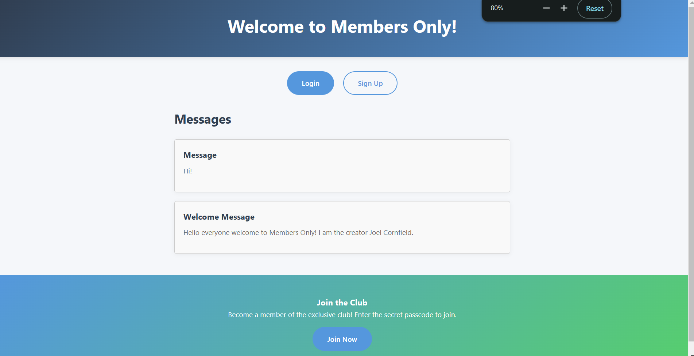
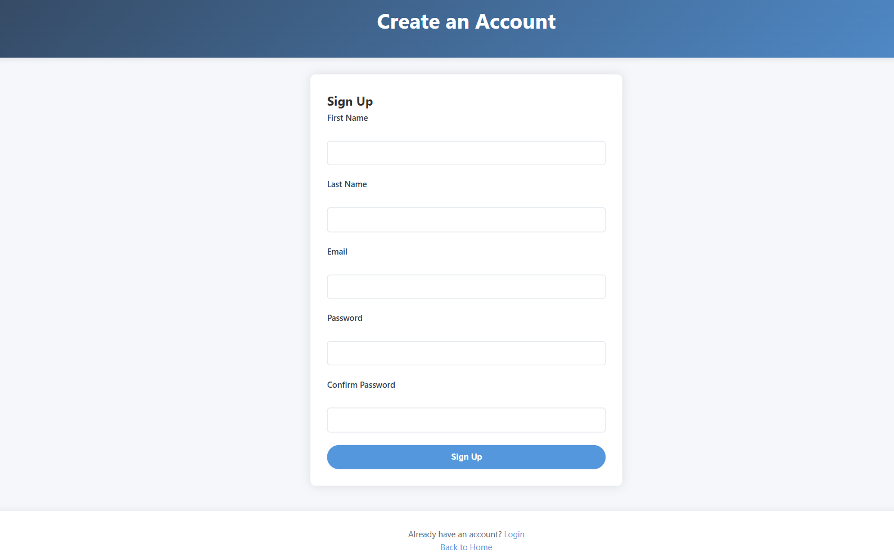
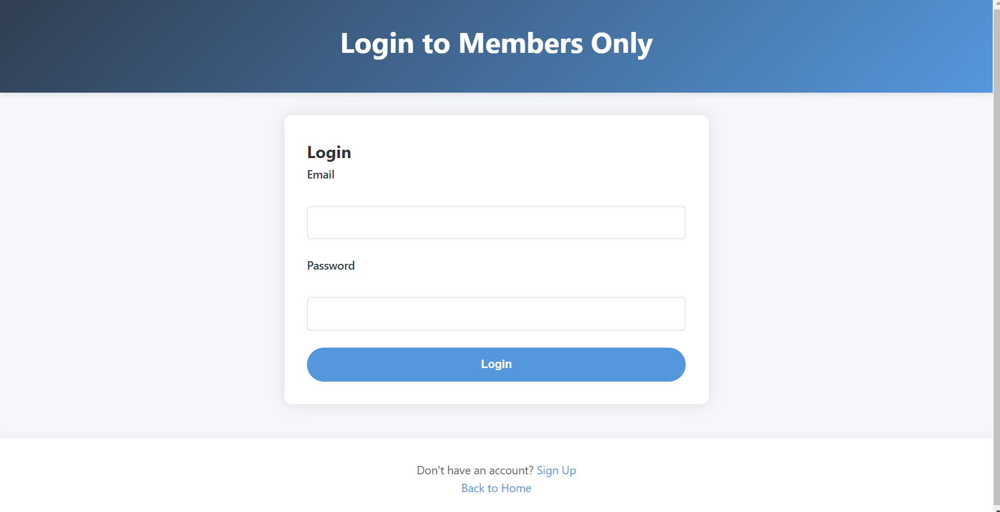
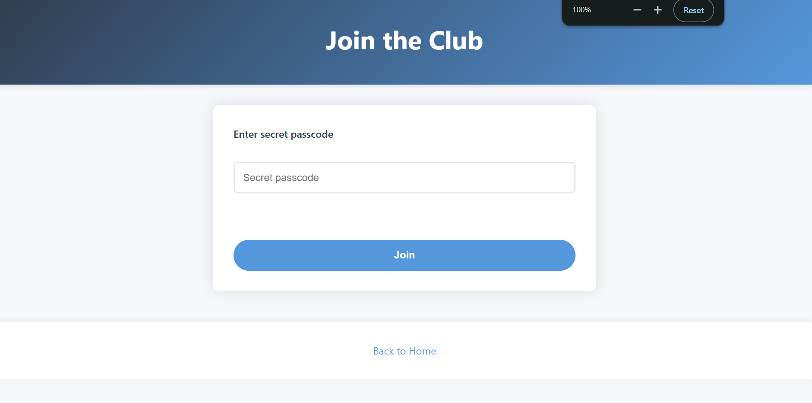
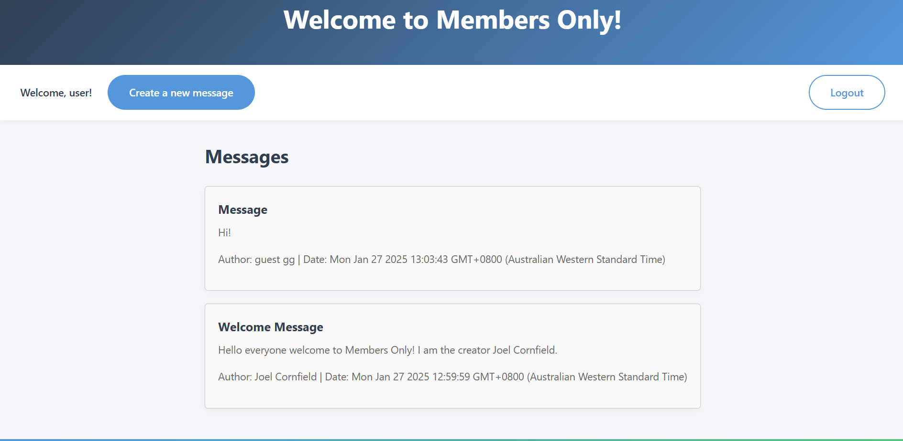
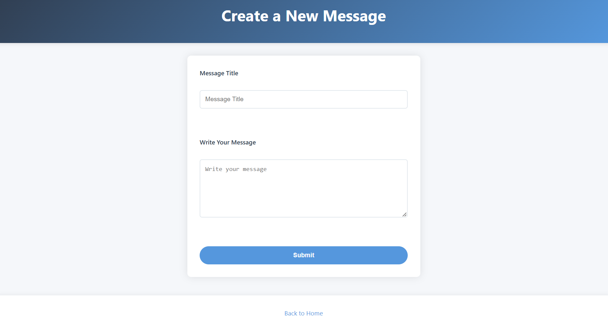
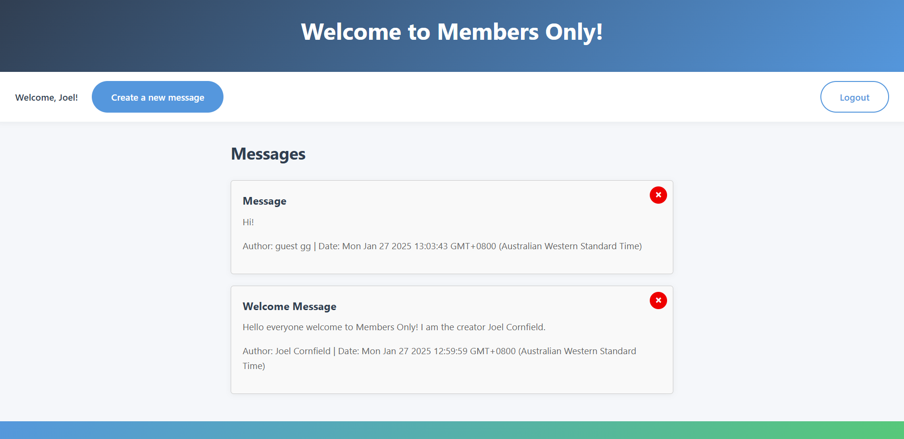
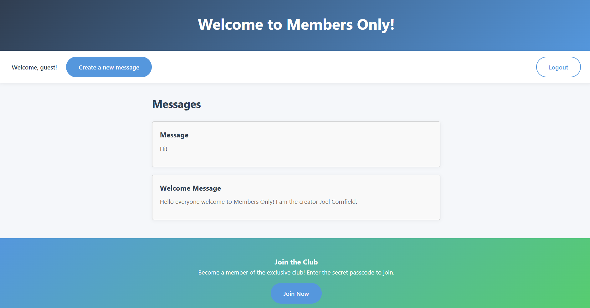

# Members Only

"Members Only" is a web application where users can sign up, log in, and become members of an exclusive club. Once they become members, they can create, view, and delete messages. The app also includes a passcode feature to join the club, and admins can manage messages.

## Features

- **User Registration & Login**: Users can sign up, log in, and access restricted features.
- **Membership**: Users can join the club by entering a secret passcode.
- **Messages**: Members can create messages, and all users can view them.
- **Admin Features**: Admins can delete messages and manage users.
- **Flash Messages**: Error and success messages are displayed to users (e.g., when the wrong passcode is entered).

## Technologies Used

- **Node.js**: Backend server
- **Express.js**: Web framework
- **Passport.js**: Authentication middleware
- **PostgreSQL**: Database to store user and message data
- **bcryptjs**: For password hashing
- **EJS**: Templating engine for rendering views
- **dotenv**: For managing environment variables

## Screenshots

### Home Page

### Sign-Up Page

### Login Page

### Join Club

### Member Page

### Create New Message

### Admin View

### Non-Members View

